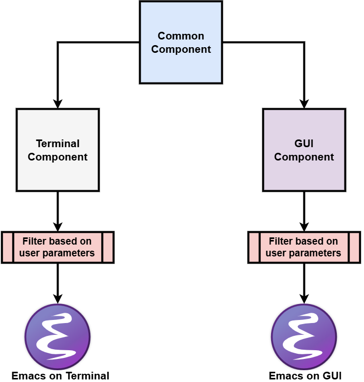

#+TITLE: My Emacs Configuration
#+AUTHOR: Chris Liourtas
#+EMAIL: cliourtas@kracked.tech
#+OPTIONS: num:nil
#+macro: latest-export-date (eval (format-time-string "%F %T %z"))
#+macro: word-count (eval (count-words (point-min) (point-max)))

* My Emacs

** About

*** Supported Languages
**** Rust
**** C
**** C++
**** Python
**** OCaml
**** Haskell
**** Java

** (POV) You Want to... 
*** [[file:pov/Email.org][Email]]
**** Send an email.
**** Read an email.
**** Save an email.
**** Write and save a draft.
*** [[file:pov/Project.org][Project]]
**** Create a Project.
**** Compile Project.
**** Build Project.
**** Execute Project.
**** Version Control Project.
**** Attach Note to Project.
**** Document Project.
*** [[file:pov/Contacts.org][Contacts]]
**** Add a Contact.
**** Query a Contact.
*** [[file:pov/Study.org][Study]]
**** Create a note that references a (saved external) source.
**** Add to bibliography.
**** Add citations to note.
**** Add links to other notes.
**** Export notes.
*** [[file:Write.org][Write]]
**** Write for your daily diary.
**** Write a thesis.
**** Write an academic paper.
**** Write for your blog.
*** [[file:Agenda.org][Agenda]]
**** Create/Edit your weekly program.
**** Add a deadline.
**** Add a task.
**** Add a goal.
**** Index deadlines,tasks and data.

** Configuration
*** Terminal
*** GUI
*** Common

** Target Hosts
*** TODO Fedora
*** TODO Debian
*** TODO Void
*** TODO Gentoo
*** TODO Arch
*** TODO Nix
*** TODO MacOS
*** TODO Windows

** Screenshots
